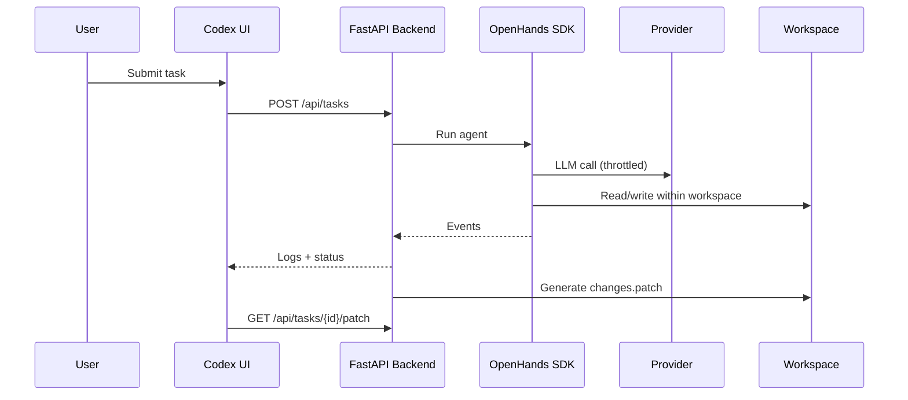
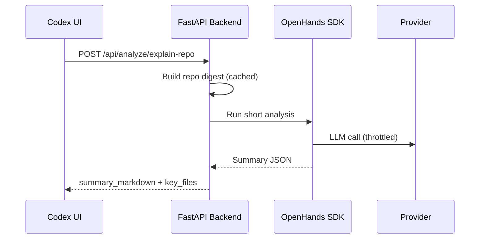

# Codex

Codex is a **local-first agent runner + web UI** for codebases. It lets you run task-driven agents against a workspace repo, stream logs, and produce patch-based edits you can review and apply.

Codex is great for:
- Task-driven repo changes (generate a patch, review, then apply)
- “Explain repo” summaries with cached, token-optimized scanning
- Architecture diagrams (Mermaid) rendered in the UI

Unlike Cursor/Copilot (autocomplete inside an editor), Codex is **task-oriented**: you give a goal, it executes tools in a sandbox, and returns a patch + audit trail.

---

## Key Features

- **Run Task**: stream logs, generate a patch, optionally apply it
- **Explain Repo**: cached + token optimized repo digest for quick summaries
- **Architecture Diagram**: Mermaid output rendered in the UI
- **Providers**:
  - **Gemini** (local dev)
  - **Azure OpenAI** via **Managed Identity** (enterprise, no API keys)
- **Safety Controls**:
  - Workspace sandbox (no access outside workspace)
  - Validate command allowlist
  - Rate limiting + retries + circuit breaker
  - Digest caching and prompt truncation

---

## Architecture

**Components**
- **UI**: React + Vite + Tailwind (`app/frontend/`)
- **Backend**: FastAPI task runner (`app/backend/`)
- **Agent Engine**: OpenHands SDK (`openhands-sdk/`, `openhands-tools/`)
- **Providers**: Gemini + Azure MI (`app/backend/providers.py`)
- **Sandbox**: file tool wrapper (`app/backend/sandbox_tools.py`)
- **Artifacts**: `.openhands_runs/<task_id>/run.jsonl`, `summary.json`, `changes.patch`

### System Diagram

```mermaid
flowchart LR
  UI[React + Vite UI] -->|HTTP| API[FastAPI Backend]
  API -->|Agent Run| SDK[OpenHands SDK]
  SDK -->|Tools| Sandbox[Workspace Sandbox]
  SDK -->|LLM Calls| Provider[Provider Layer]
  Provider --> Gemini[Gemini]
  Provider --> AzureMI[Azure OpenAI (Managed Identity)]
  API --> Artifacts[.openhands_runs/<task_id>/*]
```

### Run Task Sequence



### Explain Repo Sequence (optional)



---

## Repository Layout

```
app/
  backend/                # FastAPI backend, providers, sandbox
  frontend/               # React + Vite UI
examples/                 # SDK examples
openhands-sdk/            # Core SDK
openhands-tools/          # Tool implementations
openhands-workspace/      # Workspace management
openhands-agent-server/   # Agent server runtime
my_agent_runner.py        # CLI runner
.env.example              # Environment template (no secrets)
```

Key implementation files:
- Provider logic: `app/backend/providers.py`
- Throttling/budgeting: `app/backend/llm_call_manager.py`, `app/backend/budgets.py`
- Repo digest: `app/backend/repo_digest.py`
- Sandbox: `app/backend/sandbox_tools.py`

---

## Quickstart (Local - Gemini)

### Prereqs
- **Python 3.12** (see `.python-version`)
- **Node.js 18+**
- **uv** (recommended for Python deps)

### Setup (Mac/Linux)
```bash
python -m venv .venv
source .venv/bin/activate
uv sync --dev

cd app/frontend
npm install
cd ../..

cp .env.example .env
```

### Setup (Windows notes)
```powershell
python -m venv .venv
.\.venv\Scripts\Activate.ps1
uv sync --dev

cd app\frontend
npm install
cd ..\..

copy .env.example .env
```

### Configure .env (no secrets in README)
```bash
# Gemini (local dev)
GEMINI_API_KEY=...
LLM_MODEL=gemini/gemini-2.0-flash
VITE_API_BASE_URL=http://localhost:8000
```

> **Never commit `.env`.** It is ignored by git, and `.env.example` is provided.

### Run
```bash
# backend
uv run uvicorn app.backend.main:app --reload --port 8000

# frontend
cd app/frontend
npm run dev
```

Open: `http://localhost:5173`

### Example Usage
- **Run Task**: from the UI, enter workspace path + task
- **Explain Repo**: UI > Repo Tools > Explain Repo
- **Diagram**: UI > Repo Tools > Generate Diagram

---

## Provider Configuration

### A) Gemini (local dev)
Required env vars:
- `GEMINI_API_KEY`
- `LLM_MODEL`

Codex mitigates rate limits with:
- Concurrency limits + minimum spacing
- Retry/backoff + circuit breaker
- Turn/tool budgets
- Digest caching and prompt truncation

### B) Azure OpenAI with Managed Identity (enterprise)
Required env vars:
- `AZURE_OPENAI_ENDPOINT`
- `AZURE_OPENAI_DEPLOYMENT` **(deployment name, not raw model name)**
- `AZURE_OPENAI_API_VERSION`
- `AZURE_MANAGED_IDENTITY_CLIENT_ID` (optional for user-assigned MI)
- `AZURE_OPENAI_DEPLOYMENTS` (optional comma list for UI presets)

How it works:
- Codex uses **ManagedIdentityCredential** (no API keys)
- AAD token scope: `https://cognitiveservices.azure.com/.default`
- Each request refreshes tokens safely

Azure prerequisites:
- [ ] VM has **Managed Identity** enabled
- [ ] Identity has **RBAC** on Azure OpenAI resource (e.g. `Cognitive Services OpenAI User`)
- [ ] Deployments exist for GPT-4o / GPT-5.1 (use deployment names in config)

Recommended throttling defaults for Azure:
```
LLM_MAX_CONCURRENCY_AZURE=2
LLM_MIN_INTERVAL_MS_AZURE=250
```

---

## CLI Runner (Optional)

```bash
python my_agent_runner.py \
  --workspace "/path/to/repo" \
  --task "Summarize this repo" \
  --provider gemini
```

Azure MI:
```bash
python my_agent_runner.py \
  --workspace "/path/to/repo" \
  --task "Refactor error handling" \
  --provider azure_mi
```

Artifacts are written to:
```
.openhands_runs/<task_id>/
  run.jsonl
  summary.json
  changes.patch
```

---

## Validation Commands (Allowlist)

Pass validate commands via UI or CLI (semicolon-separated):
```
pytest; python -m pytest; npm test; npm run build; ruff; mypy; cmake --build; ctest; make; ninja; git diff; git status
```

If a command is not in the allowlist, the run fails with a clear error and logs it to `run.jsonl`.

---

## Troubleshooting

**429 Too Many Requests**
- The provider is rate limiting. Codex will queue, retry, and back off.
- Adjust `LLM_MAX_CONCURRENCY_*` and `LLM_MIN_INTERVAL_MS_*`.

**Missing env vars**
- Check `.env` or environment variables. Errors are logged in `summary.json`.

**Workspace path invalid**
- The path must exist and be a directory. The sandbox blocks traversal.

**Azure RBAC/auth errors**
- Ensure Managed Identity is enabled and has RBAC on the Azure OpenAI resource.
- Confirm deployment names and API version.

Where to look:
- `.openhands_runs/<task_id>/run.jsonl`
- `.openhands_runs/<task_id>/summary.json`
- Backend console logs

---

## Security Notes

- **Never commit `.env`** (use `.env.example` only)
- Workspace sandbox blocks access outside the repo
- `.env` files are blocked from reads
- All tool actions and outputs are logged to `run.jsonl`
- “Apply patch” is gated and can be disabled via repo scope

---

## License / Disclaimer

This repository builds on the **OpenHands SDK** (see `openhands-sdk/`).

Use Codex responsibly. Always review patches before applying them.

See `LICENSE` for details.
